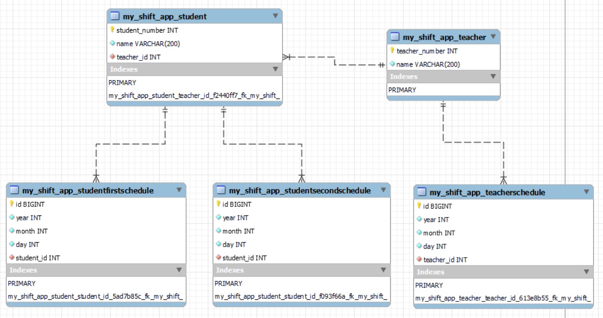

<p align="center">
   
</p>
<p align="center">
     
   
   
   
   
   
   
</p>

## Shift Management 概要
初めてのチーム開発(技育CAMPハッカソンVol7)で作成したWebアプリ  

## 開発背景
- 現状では紙でシフト希望を提出し、それをもとにして社員が手動でシフトを組んでいる  
- 紙だと管理が煩雑になる  
- 記入する側の人も面倒  
- バイトしている側もシフトを組む側もどちらも楽になりたい


## チームメンバー
| Name | GitHub Account | Development　|
| ---- | ---- | ---- |
| Hiroto Tsuchida | https://github.com/Da-Tsuchi | バックエンド（Python,django,MySQL）
| Koshiro Itaya | https://github.com/itaya0320 | 要件定義・フロントエンド（css,javascript）

## 使用した技術
<!-- <style>
.table2 > table, .table2 > th, .table2 > td {
   font-size: 120%;
}
</style> -->

<div class="table2">

| Front End |Back End|Database|others|
| :----: | :----: | :----: | :----: |
| HTML<br>CSS<br>JavaScript<br>- JQuery| Python<br>- Django| MySQL|Git/GitHub<br>VSCode|

</div>

## 実装した機能
### 講師登録
- 講師番号、講師名を指定  


### 生徒登録
- 生徒番号、生徒名、生徒の担当講師を指定


### 講師の希望日程の登録
- ラジオボタン形式で入れるか入れないかを選択  


### 生徒の希望日程の登録
- 候補の講師リストから選択する


### シフト作成
 
### 講師割り当て最適化
 


## データベース設計


## ローカルでの動作要件
### WSL2
- Ubuntu 22.04
- Python 3.10.12
- Django 4.2.3
- mysqlclient 2.1.1
- mysqlserver

## ローカルでの動作方法
### ターミナルで任意のディレクトリまで移動
```
git clone https://github.com/Da-Tsuchi/Hack.git
cd shift
python3 manage.py runserver [your port]
```
 
